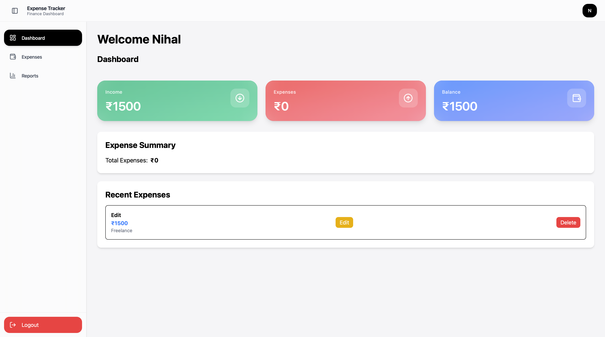
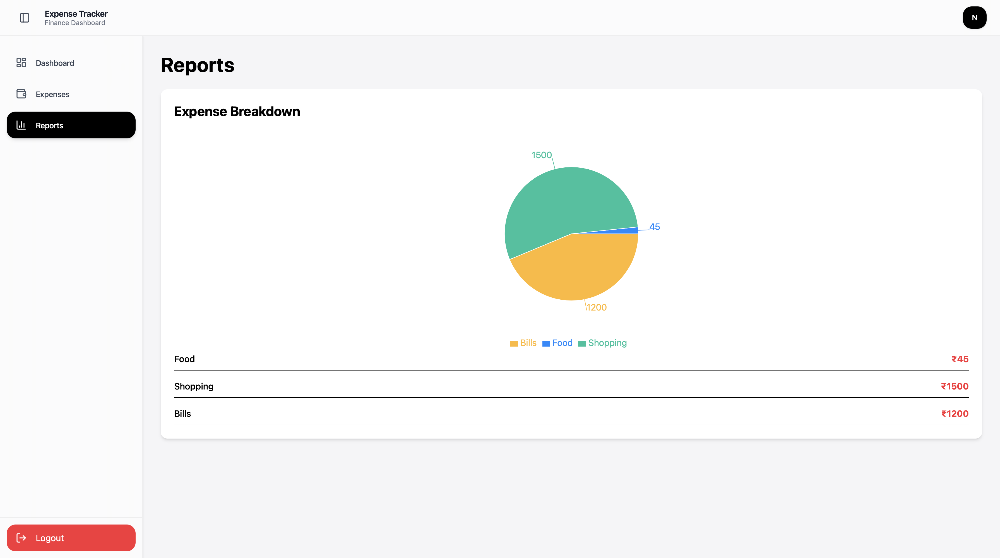
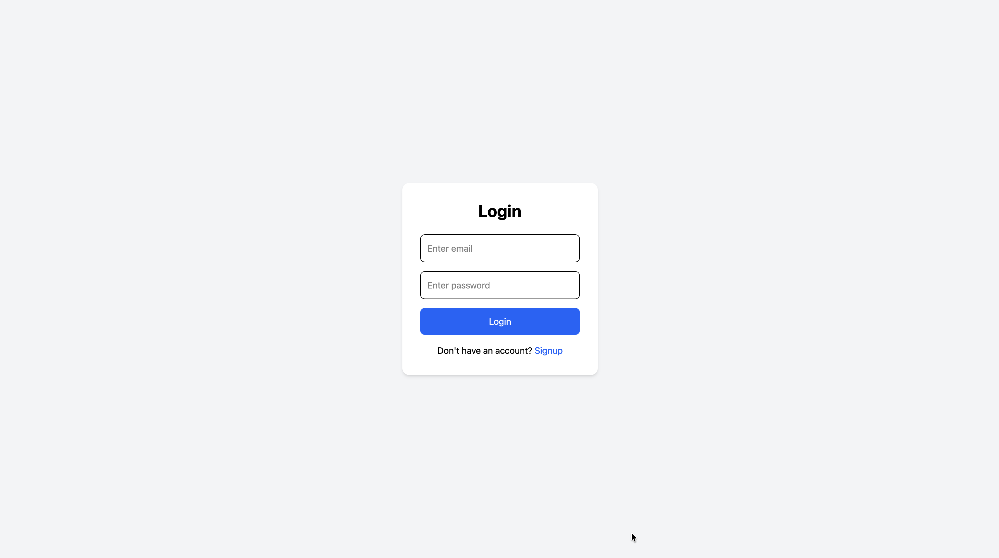

# Expense Tracker

A modern expense tracker application built using the MERN stack with secure JWT authentication, expense analytics, interactive reports, and a clean responsive dashboard inspired by Apple design.


---

# Features

## Authentication

* User Signup & Login
* JWT Authentication
* Protected Routes
* Persistent Login using Local Storage

## Expense Management

* Add Income & Expenses
* Edit Transactions
* Delete Transactions
* Category Filtering
* Multi-user Expense Isolation

## Dashboard

* Total Income Calculation
* Total Expense Calculation
* Balance Overview
* Recent Transactions
* Responsive Dashboard Cards

## Reports

* Expense Analytics
* Category Breakdown
* Interactive Charts using Recharts

## UI/UX

* Apple-inspired UI Design
* Glassmorphism Effects
* Responsive Sidebar Navigation
* Smooth Animations
* Modern Dashboard Layout

---

# Tech Stack

## Frontend

* React.js
* Vite
* Tailwind CSS
* Axios
* React Router DOM
* Recharts
* Lucide React

## Backend

* Node.js
* Express.js
* MongoDB Atlas
* Mongoose
* JWT Authentication
* bcrypt.js

---

# Project Structure

```bash
expense-tracker/
│
├── backend/
│   ├── config/
│   ├── controllers/
│   ├── middleware/
│   ├── models/
│   ├── routes/
│   ├── .env
│   ├── package.json
│   └── server.js
│
├── frontend/
│   ├── public/
│   ├── src/
│   │   ├── components/
│   │   ├── context/
│   │   ├── hooks/
│   │   ├── layouts/
│   │   ├── pages/
│   │   ├── services/
│   │   ├── App.jsx
│   │   └── main.jsx
│   │
│   ├── package.json
│   ├── package-lock.json
│   ├── vite.config.js
│   ├── eslint.config.js
│   └── index.html
│
├── screenshots/
│   ├── dashboard.png
│   ├── reports.png
│   └── authentication.png
│
├── .gitignore
└── README.md
```

---

# Installation

## Clone Repository

```bash
git clone https://github.com/nihal514t/expense-tracker.git
```

---

# Frontend Setup

```bash
cd frontend

npm install

npm run dev
```

---

# Backend Setup

```bash
cd backend

npm install

npm run dev
```

---

# Environment Variables

Create a `.env` file inside the `backend/` folder.

```env
MONGO_URI=your_mongodb_connection_string

JWT_SECRET=your_secret_key

PORT=8000
```

---

# Screenshots

## Dashboard



---

## Reports



---

## Authentication



---

# Future Improvements

* Dark Mode
* PDF Export
* Transaction Search
* Monthly Analytics
* Recurring Expenses
* User Profile Settings
* Pagination
* Budget Goals

---

# Author

Muhammed Nihal

GitHub:
https://github.com/nihal514t

---

# License

This project was created for educational purposes and personal portfolio use.
